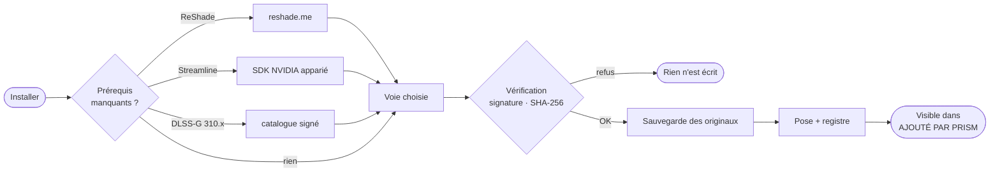

<div align="center">

# ◆ Prism

### La pile graphique de vos jeux, maîtrisée de bout en bout.

DLSS 5 Neural Rendering · Multi Frame Generation · HDR RenoDX · ReShade
<br/>installés en un clic, vérifiés avant chaque écriture, retirés en un clic.

<br/>


<br/>

[Fonctionnalités](#-fonctionnalités) ·
[Installer, puis retirer](#-installer-puis-retirer) ·
[DLSS 5](#-dlss-5--neural-rendering) ·
[Frame Generation](#-frame-generation) ·
[HDR](#-hdr-renodx-automatique) ·
[Sécurité](#-sécurité) ·
[Compiler](#-compiler-et-lancer)

</div>

---

## ✦ En bref

Prism détecte les jeux installés sur le PC, lit ce que chacun embarque réellement —
runtimes DLSS, Streamline, moteur, API de rendu — et pose la bonne pile pour la carte
graphique présente. Chaque fichier vient d'une source publique suivie, chaque DLL NVIDIA
est vérifiée avant d'être écrite, et tout ce que Prism ajoute reste visible sur le jeu,
prêt à être retiré.

> [!NOTE]
> Outil **Windows**, application **WPF .NET 10**, **zéro dépendance NuGet**. Aucune
> version de composant n'est figée dans le code : les sources sont interrogées à chaque
> démarrage.

---

## ✦ Fonctionnalités

<table>
<tr>
<td width="50%" valign="top">

#### 🧠 DLSS 5 — Neural Rendering
Le paquet **RenoDX DLSS 5** complet : addon, DLSS 310.8, Streamline 2.13 et le runtime
neural adapté au GPU. Signature NVIDIA exigée, empreinte épinglée pour la build RTX 20–40.

</td>
<td width="50%" valign="top">

#### 🎞️ Multi Frame Generation
Voies filtrées par génération : MFG natif sur RTX 50, **RenoDX MFG Unlock** ×2 à ×6 sur
RTX 40, DLSS-G porté sur RTX 30 et 20, repli FSR 3.1 partout.

</td>
</tr>
<tr>
<td valign="top">

#### 🌈 HDR RenoDX automatique
Le wiki RenoDX est lu **en direct** : bon mod par jeu, notes de la ligne appliquées
(`Upgrade_R11G11B10_FLOAT`, `Engine.ini`…), rien de deviné.

</td>
<td valign="top">

#### 🧾 Tout est tracé, tout se retire
Bandeau **AJOUTÉ PAR PRISM** sur chaque jeu : une pastille par installation, un bouton
**Retirer**. Retour vanille complet avec vérification SHA-256.

</td>
</tr>
<tr>
<td valign="top">

#### 🔍 Diagnostic réel
Chaîne de rendu effectivement chargée, matrice de compatibilité Streamline / DLSS-G,
compilateur de shaders périmé détecté et remplacé.

</td>
<td valign="top">

#### 🌍 18 langues
Interface traduite, arabe de droite à gauche, bascule instantanée depuis
**Paramètres ▸ Langue**.

</td>
</tr>
</table>

---

## ✦ Installer, puis retirer

### Un seul bouton : Installer

Pas de « préparer », pas d'« installer seulement », pas de demi-mesure. **Installer**
télécharge et pose **tout** ce que la voie exige, dans l'ordre, puis la voie elle-même.
Le premier échec arrête la chaîne : une pile incomplète n'est jamais laissée en place.



### Ce que Prism a ajouté, sous les yeux

En revenant sur un jeu — page **Jeux**, **DLSS** ou **Frame Gen** — le bandeau
**AJOUTÉ PAR PRISM** liste chaque installation encore en place :

```
AJOUTÉ PAR PRISM   ● RenoDX DLSS 5  5.2.1  [Retirer]   ● RenoDX HDR  [Retirer]   ● ReShade  6.8.0  [Retirer]
```

Le survol détaille les fichiers posés ou remplacés. **Retirer** défait l'installation
entière, pas un fichier isolé :

| Installation | Ce que « Retirer » remet en état |
|---|---|
| **RenoDX DLSS 5** | fichiers ajoutés supprimés, originaux restaurés (DLL NVIDIA, Streamline, compilateur), addon retiré de `LoadFromDllMain` |
| **RenoDX HDR** | addon supprimé, clés `[renodx]` remises à leur valeur d'avant, `Engine.ini` restauré |
| **RenoDX MFG Unlock** | addon et section `[RenoDX.MFGUnlock]` retirés |
| **ReShade** | moteur et proxy retirés — presets et shaders de l'utilisateur conservés |
| **DLSS SR / DLSS-G / Streamline** | versions d'origine du jeu restaurées |

Chaque fichier écrit est rattaché à l'installation qui l'a posé. Un original déjà
restauré ne compte plus : le bandeau montre l'état réel du dossier, pas un historique.

### Retour vanille

La page **Changes** va plus loin, titre par titre : vérification SHA-256 de chaque
fichier écrit (*intact · modifié depuis · disparu · sauvegarde perdue*), détection des
orphelins laissés par d'autres outils, et restauration complète. Un fichier modifié hors
de Prism n'est jamais écrasé en silence.

---

## ✦ DLSS 5 — Neural Rendering

La voie dépend de l'API du jeu :

| API | Voie | Pourquoi |
|---|---|---|
| **DirectX 12** | **RenoDX DLSS 5** *(recommandé)* | pile complète, vérifiée fichier par fichier |
| DirectX 12 | OptiScaler DLSSNR · PreSR Multipass | passe neurale dans le pipeline, ReShade non requis |
| DirectX 11 · Vulkan | DLSS 5 Bridge | le pont reflète l'appel DLSS natif |
| DX11 ou DX12 | DLSS5 One-Click | installeur unique, RTX 20–50 |

### Le paquet RenoDX DLSS 5

| Composant | Source | Contrôle |
|---|---|---|
| `renodx-dlss5.addon64` | `RankFTW/rhi-repo`, build au choix (la plus récente par défaut) | inscrit en chargement précoce |
| `nvngx_dlss` · `dlssg` · `dlssd` | `rhi-repo` — 310.8.0 · 310.8.0 · 310.7.129 | Authenticode NVIDIA |
| `sl.*` | `rhi-repo` — Streamline 2.13 | Authenticode NVIDIA |
| `nvngx_dlssnr.dll` | `rhi-repo`, selon le GPU | signé NVIDIA **ou** SHA-256 épinglé |

- **RTX 50** — `dlssnr-310.8.0`, l'original signé NVIDIA.
- **RTX 20 à 40** — l'original y échoue (`0xBAD00001`) : Prism pose `dlssnr-310.8.SF-v2`,
  accepté **uniquement** si son empreinte figure dans `NeuralRuntimePins`.

Le contrôle est **tout ou rien** : une seule DLL refusée, et le jeu n'est pas touché.

> [!TIP]
> **`X3506: unrecognized compiler target 'cs_5_1'`** en boucle dans le journal ReShade ?
> Le jeu embarque un `d3dcompiler_47.dll` de Windows 8.1, chargé avant celui du système.
> Prism le signale (ligne **D3DCOMPILER**) et le remplace par la copie de Windows lors de
> l'installation, original sauvegardé.

---

## ✦ Frame Generation

Le jeu doit déjà intégrer Streamline DLSS-G : aucune surcouche ne crée la génération
d'images à partir de rien. L'interface distingue le **moteur NVIDIA** du **pont FSR 3.1**.

| GPU | Voie recommandée | Alternatives |
|---|---|---|
| RTX 50 · Blackwell | DLSS-G natif ×2–×4 | OptiScaler, DLSS Enabler |
| RTX 40 · Ada | **RenoDX MFG Unlock** ×2–×6 | DLSS-G natif ×2, RTX40MFG-Unlock |
| RTX 30 · Ampere | **dlssg for sm_86** ×2–×4 | OptiScaler, DLSS Enabler |
| RTX 20 · Turing | **dlssg for sm_75** ×2–×4 | OptiScaler, DLSS Enabler |

Règles tenues par la matrice de compatibilité :

- MFG dynamique = DLSS-G **310.9.1** + Streamline **2.14.1** + pilote **595.41+** + D3D12.
- Streamline antérieur à **2.12.129** : le wrapper bloque, pas le runtime.
- Les composants `sl.*` de deux paquets ne se mélangent **jamais**.

---

## ✦ HDR RenoDX automatique

Au démarrage, Prism lit la [liste des mods RenoDX](https://github.com/clshortfuse/renodx/wiki/Mods)
et construit un **plan** par jeu, affiché sur la page **Injection** :

1. **Ligne dédiée** du wiki (AppID Steam, puis nom) → l'addon du jeu.
2. **Tableau moteur** — un jeu Unreal listé sous *UE Extended* reçoit l'addon générique,
   **et les notes de sa ligne sont appliquées** : clés `ReShade.ini`, bloc `Engine.ini`
   écrit dans `%LOCALAPPDATA%\<Projet>\Saved\Config\…` puis passé en lecture seule.
3. Build dédiée de l'index snapshot, puis addon générique du moteur.

Chaque étape porte son étiquette : `PRISM` (appliquée), `VÉRIFIER`, ou `VOUS` (à faire
dans le jeu). Une note ambiguë n'est jamais convertie en réglage ; un mod publié
uniquement sur Nexus ou Discord est signalé, pas deviné.

---

## ✦ Sécurité

| Garantie | Mise en œuvre |
|---|---|
| DLL NVIDIA authentiques | `WinVerifyTrust` + signataire du certificat |
| Runtime neural patché | accepté seulement sur SHA-256 épinglé |
| Catalogue DLSS | manifeste signé + MD5 vérifié avant écriture |
| Aucun original perdu | copie avant remplacement, première version conservée |
| Désinstallation exacte | registre par fichier, par installation, avec empreinte |
| Fichiers de l'utilisateur | presets ReShade, `dxgi.dll` étrangers et fichiers modifiés hors Prism jamais écrasés |

**Liste noire.** `Optiscaler-Client` est écarté : l'équipe OptiScaler déclare n'avoir
aucune application de gestion officielle.

> [!WARNING]
> Les surcouches chargent une bibliothèque dans le processus du jeu. En multijoueur
> protégé par un anti-triche, cela peut être interprété comme une intrusion. **À
> réserver au solo.**

---

## ✦ Sources suivies

| Composant | Dépôt | Rôle |
|---|---|---|
| RenoDX DLSS 5 | [`RankFTW/rhi-repo`](https://github.com/RankFTW/rhi-repo/releases) | addon + pile DLSS / Streamline / runtime neural |
| RenoDX HDR | [`clshortfuse/renodx`](https://github.com/clshortfuse/renodx) · [wiki](https://github.com/clshortfuse/renodx/wiki/Mods) | mods HDR par jeu |
| RenoDX MFG Unlock | [`mavismmg/MFGAdaUnlock-RenoDx`](https://github.com/mavismmg/MFGAdaUnlock-RenoDx) | MFG sur Ada |
| Runtimes DLSS | [`beeradmoore/dlss-swapper`](https://github.com/beeradmoore/dlss-swapper) | manifeste signé + MD5 |
| Streamline SDK | [`NVIDIA-RTX/Streamline`](https://github.com/NVIDIA-RTX/Streamline) | `sl.*` apparié, source officielle |
| ReShade | [reshade.me](https://reshade.me/) | hôte des addons |
| RTX40MFG-Unlock | [`dashdogy/RTX40MFG-Unlock`](https://github.com/dashdogy/RTX40MFG-Unlock) | MFG Ada via proxy |
| OptiScaler | [`optiscaler/OptiScaler`](https://github.com/optiscaler/OptiScaler) | FSR-FG / XeSS-FG |
| OptiScaler DLSSNR | [`Dagherbou/OptiScaler_DLSSNR`](https://github.com/Dagherbou/OptiScaler_DLSSNR) | Neural Rendering DX12 |
| PreSR Multipass | [`wilsjo2/OptiScaler-DLSSNR-PreSR-Multipass`](https://github.com/wilsjo2/OptiScaler-DLSSNR-PreSR-Multipass) | Neural Rendering DX12 |
| DLSS 5 Bridge | [`NIGos/dlss5-bridge`](https://github.com/NIGos/dlss5-bridge) | Neural Rendering DX11 / Vulkan |
| DLSS5 One-Click | [`faisalkindi/DLSS5oneclick`](https://github.com/faisalkindi/DLSS5oneclick) | installeur unique |
| dlssg for sm_86 | [`sdli1995/dlssg_for_sm86`](https://github.com/sdli1995/dlssg_for_sm86) | DLSS-G porté RTX 30 |
| dlssg for sm_75 | [`Coldwood1026/dlssg_for_sm75`](https://github.com/Coldwood1026/dlssg_for_sm75) | DLSS-G porté RTX 20 |
| DLSS Enabler | [`artur-graniszewski/DLSS-Enabler`](https://github.com/artur-graniszewski/DLSS-Enabler) | repli FSR 3.1 |

---

## ✦ Langues

English · Français · Deutsch · Español · Italiano · Português (Brasil) · Русский ·
Українська · Polski · Türkçe · العربية · हिन्दी · 日本語 · 한국어 · 简体中文 · 繁體中文 ·
Bahasa Indonesia · Tiếng Việt

La langue de Windows est choisie au premier lancement. Les textes vivent dans
`Lang/<code>.json`, embarqués dans l'exécutable, avec repli *langue → anglais → clé*.

---

## ✦ Compiler et lancer

Prérequis : **SDK .NET 10**, Windows 10 ou 11.

```powershell
dotnet build -c Release
Start-Process .\bin\Release\net10.0-windows\Prism.exe -Verb RunAs
```

L'élévation est demandée au lancement (`app.manifest`) : les dossiers de jeux vivent
souvent sous `Program Files`, où le remplacement de DLL échouerait sans droits.

> [!IMPORTANT]
> Si Prism est ouvert, `Prism.exe` est verrouillé et la compilation échoue à la copie.
> Fermez l'application, ou compilez ailleurs : `dotnet build -c Release -o build`.

---

## ✦ Architecture

```
Prism/
├─ Core/            MVVM minimal, convertisseurs, localisation (Loc), molette
├─ Lang/            18 fichiers de traduction, embarqués
├─ Models/          jeux, DLL, GPU, voies, registre, plans HDR
├─ Services/        scan, détection, téléchargement, signature, installeurs,
│                   registre des modifications, retour vanille, wiki RenoDX
├─ ViewModels/      MainViewModel (coquille), GameDetailViewModel
├─ Views/           fenêtre + 9 pages
│  └─ Controls/     GameBar, InstalledStrip, StatusDot, Field, Pipeline
└─ Themes/          Tokens, Base, Inputs, Data
```

| Page | Rôle |
|---|---|
| **Overview** | pile graphique, capacités DLSS, pipeline de rendu |
| **Games** | bibliothèque + inspecteur, **ajouté par Prism** |
| **DLSS** | runtimes SR / DLSS-G / RR, DLSS 5 |
| **Frame Gen** | voies par GPU, multiplicateur, réglages MFG |
| **Injection** | chaîne chargée, ReShade, plan HDR |
| **Changes** | registre complet, vérification, retour vanille |
| **Components** | sources suivies et provenance |
| **Logs** | journal structuré, filtre, export |
| **Settings** | langue, bibliothèques, sauvegardes, sécurité |

---

<div align="center">
<sub>Prism ne distribue aucun binaire tiers : il télécharge depuis les sources officielles,
vérifie, et garde la trace de chaque octet écrit.</sub>
</div>
