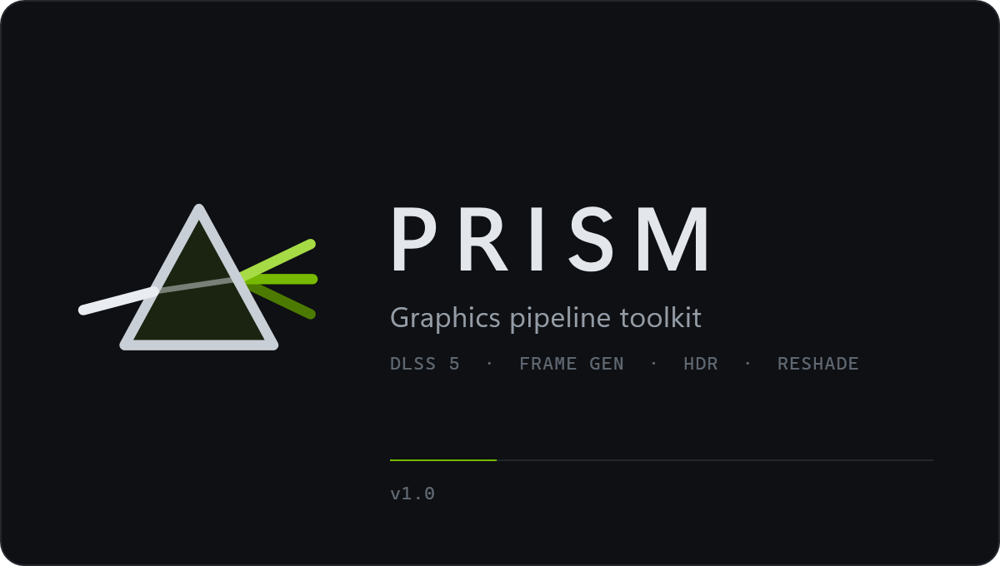
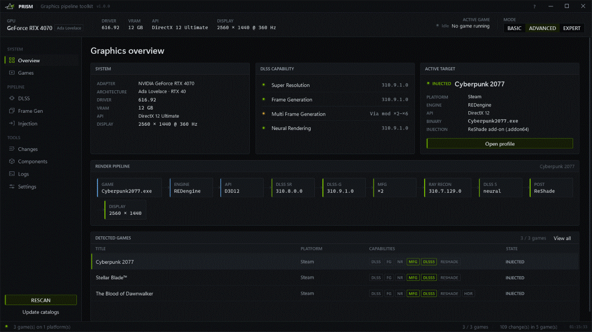
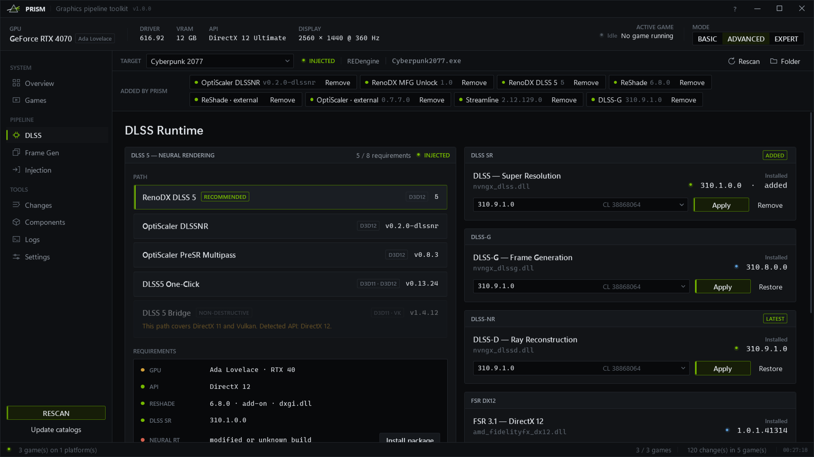
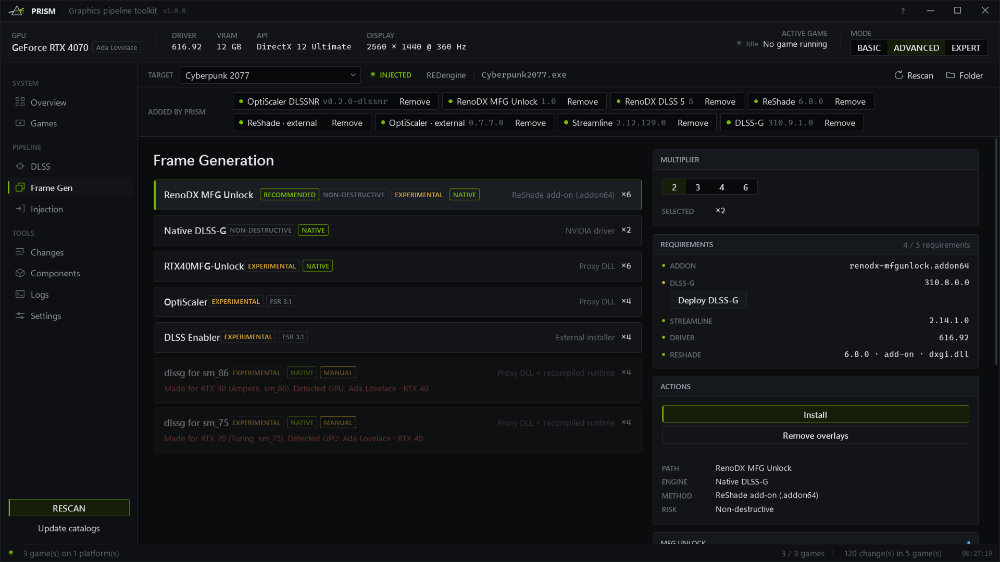
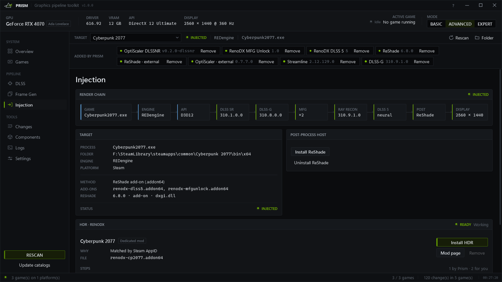
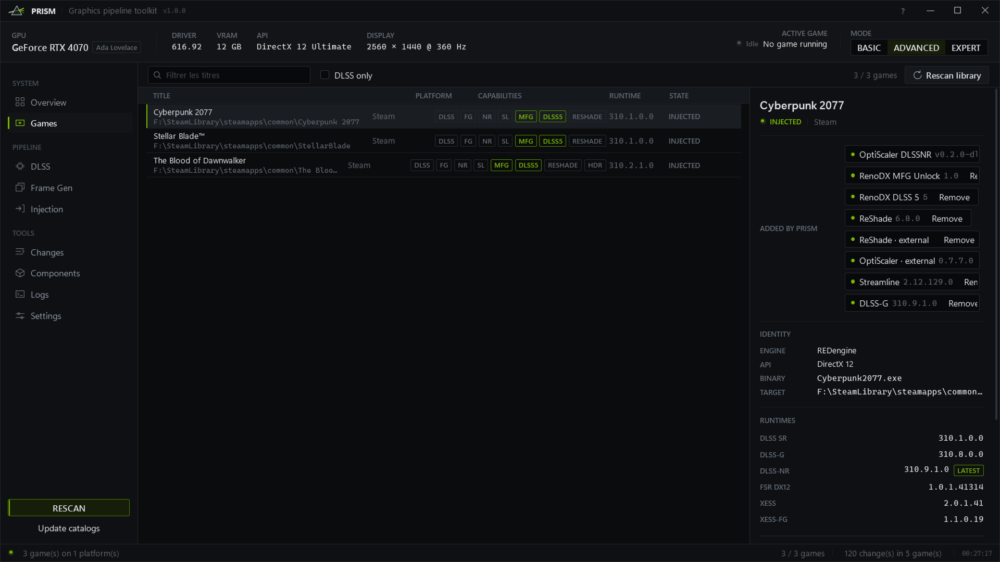
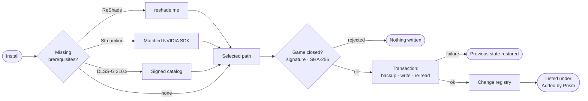

<div align="center">



### The graphics stack of your PC games — installed, verified, reversible.

DLSS 5 Neural Rendering · Multi Frame Generation · RenoDX HDR · ReShade

<br/>

[](https://github.com/Skynizz/Prism/releases/latest)
[](https://github.com/Skynizz/Prism/releases)


[](LICENSE)

**[Download](#download)** · [Features](#features) · [How it works](#how-it-works) · [DLSS 5](#dlss-5--neural-rendering) · [Frame Generation](#frame-generation) · [Safety](#safety) · [FAQ](#faq)

<br/>



</div>

---

## Overview

Prism scans the games installed on your PC, reads what each one actually ships — DLSS
runtimes, Streamline, engine, rendering API — and installs the right stack for your GPU
in one click. Every file comes from a tracked public source, every NVIDIA DLL is verified
before it is written, and everything Prism adds stays listed on the game, ready to be removed.

- **One button.** *Install* downloads and places every prerequisite, then the mod itself.
- **Nothing half-done.** Each install is a transaction: backed up, written, re-read, or fully rolled back.
- **Nothing hidden.** Every file Prism wrote is tracked per game and removable in one click.
- **Nothing bundled.** Prism ships no third-party binary; it fetches from the official sources.

---

## Download

| Package | For | |
|---|---|---|
| **`Prism-Setup-<version>.exe`** | Most users — Start menu entry, uninstaller, automatic updates | **[Latest release →](https://github.com/Skynizz/Prism/releases/latest)** |
| `Prism-<version>-win-x64.zip` | Portable use — extract anywhere in your user folder | [Releases](https://github.com/Skynizz/Prism/releases) |
| Source code (`zip` / `tar.gz`) | Review or build it yourself | attached to every release |

Each release publishes a `.sha256` checksum next to every file.

### Requirements

| | Minimum |
|---|---|
| OS | Windows 10 1809 or Windows 11, x64 |
| GPU | Any GPU for ReShade and HDR · NVIDIA RTX 20 series or newer for DLSS paths |
| Runtime | None — the .NET runtime is included |
| Network | Required to download components and updates |

> [!NOTE]
> **Installs per user, no admin needed** (`%LOCALAPPDATA%\Programs\Prism`). Prism itself asks
> for elevation at launch, because game folders often live under `Program Files`.
>
> Until the binaries are code-signed, Windows SmartScreen may show *“Windows protected your
> PC”*: choose **More info → Run anyway**, after checking the file against its `.sha256`.

---

## Features

<table>
<tr>
<td width="50%" valign="top">

#### DLSS 5 — Neural Rendering
The complete **RenoDX DLSS 5** package: add-on, DLSS 310.8, Streamline 2.13 and the neural
runtime matched to your GPU. NVIDIA signature required; pinned checksum for the RTX 20–40 build.

</td>
<td width="50%" valign="top">

#### Multi Frame Generation
Paths filtered by GPU generation: native MFG on RTX 50, **RenoDX MFG Unlock** ×2–×6 on RTX 40,
ported DLSS-G on RTX 30 and 20, FSR 3.1 fallback everywhere.

</td>
</tr>
<tr>
<td valign="top">

#### RenoDX HDR, automatic
The RenoDX mod list is read **live**: the right mod per game, and the notes of its row applied
(`Upgrade_R11G11B10_FLOAT`, `Engine.ini`…). Nothing guessed.

</td>
<td valign="top">

#### Tracked and reversible
An **Added by Prism** strip on every game: one entry per install, one **Remove** button.
Full vanilla restore with SHA-256 verification.

</td>
</tr>
<tr>
<td valign="top">

#### Real diagnostics
The render chain actually loaded, a Streamline / DLSS-G compatibility matrix, outdated shader
compilers detected and replaced, mods installed outside Prism detected.

</td>
<td valign="top">

#### Built for everyone
18 languages with right-to-left Arabic, two themes, an interface that scales from a laptop
window to a 4K display, and self-updates from GitHub Releases.

</td>
</tr>
</table>

<div align="center">




</div>

---

## How it works



| Guarantee | How |
|---|---|
| No partial install | Every write goes through a transaction: original backed up, new file written beside it and swapped atomically, re-read and compared to its source. First failure → everything touched is restored. |
| No write while the game runs | Prism refuses to act while the game executable is running or a target file is locked — the #1 cause of half-installed DLSS stacks. |
| No original lost | The first version of every replaced file is kept; later installs never overwrite that backup. |
| Exact uninstall | A per-file, per-install registry with checksums. *Remove* undoes a whole install, not a single file. |

### ReShade: kept when it is already there

| In the game | What Prism does |
|---|---|
| ReShade **add-on ≥ 6.8** already loaded, under any name | nothing — no download |
| Standard or outdated ReShade | replaced **in place**, same name, original backed up |
| No ReShade | name chosen from the executable's imports: `d3d9.dll`, `opengl32.dll`, otherwise `dxgi.dll` |
| Proxy already used by OptiScaler | `ReShade64.dll` + `[Plugins] LoadReshade=true` |
| Proxy used by another tool | `d3d12.dll` / `d3d11.dll` depending on the API, otherwise refused — never overwritten |
| ReShade loaded twice | reported, install blocked |
| Vulkan game | refused: ReShade goes through its global Vulkan layer |

The DLL is extracted from the official reshade.me installer **without running it**. The add-on
build is identified without guessing: the standard build contains the string
*“only limited add-on functionality”*, the add-on build does not.

### Mods installed outside Prism

The same strip lists what the game contains beyond its original files without Prism having
placed it — ReShade, RenoDX add-ons, OptiScaler, DLSS Enabler, dlssg-to-fsr3, Special K,
DLSSTweaks, ASI loaders, `nvngx_dlssnr.dll`. Known mod files can be **set aside** (copied to
Prism's backups, then removed); NVIDIA runtimes replaced by hand are flagged, never guessed.

---

## DLSS 5 — Neural Rendering

| API | Path | Why |
|---|---|---|
| **DirectX 12** | **RenoDX DLSS 5** *(recommended)* | full stack, verified file by file |
| DirectX 12 | OptiScaler DLSSNR · PreSR Multipass | neural pass inside the pipeline, no ReShade needed |
| DirectX 11 · Vulkan | DLSS 5 Bridge | mirrors the native DLSS call |
| DirectX 11 or 12 | DLSS5 One-Click | single installer, RTX 20–50 |

### The RenoDX DLSS 5 package

| Component | Source | Check |
|---|---|---|
| `renodx-dlss5.addon64` | `RankFTW/rhi-repo`, selectable build (latest by default) | registered for early loading |
| `nvngx_dlss` · `dlssg` · `dlssd` | `rhi-repo` — 310.8.0 · 310.8.0 · 310.7.129 | NVIDIA Authenticode |
| `sl.*` | `rhi-repo` — Streamline 2.13 | NVIDIA Authenticode |
| `nvngx_dlssnr.dll` | `rhi-repo`, per GPU | NVIDIA-signed **or** pinned SHA-256 |

- **RTX 50** — `dlssnr-310.8.0`, the original NVIDIA-signed runtime.
- **RTX 20 to 40** — the original fails there (`0xBAD00001`); Prism installs `dlssnr-310.8.SF-v2`,
  accepted **only** if its checksum is pinned in `NeuralRuntimePins`.

The check is **all or nothing**: one rejected DLL and the game is not touched.

**Placement.** NGX DLLs and `sl.*` go where the game loads Streamline (on Unreal,
`Plugins\…\ThirdParty\Win64`). `nvngx_dlssnr.dll` also goes **next to the executable**, where
the add-on loads it.

<details>
<summary><b>Troubleshooting</b></summary>

| Symptom | Cause | Prism |
|---|---|---|
| Overlay shows *“NO NR FEATURE MATCHED”*, `0xBAD0000B` | `nvngx_dlssnr.dll` missing next to the executable: the add-on falls back to the driver runtime, rejected on RTX 20–40 | **NEURAL RT** row in error, *Install* places it |
| `0xBAD00005` on every NR evaluation | a modified or unknown `nvngx_dlssnr.dll` | flagged as untrusted, replaced, original backed up |
| `X3506: unrecognized compiler target 'cs_5_1'` in the ReShade log | the game ships a Windows 8.1 `d3dcompiler_47.dll` | **D3DCOMPILER** row, replaced by the Windows copy |
| *“being used by another process”* | the game or its launcher is still running | install refused until it is closed |

</details>

---

## Frame Generation

The game must already integrate Streamline DLSS-G: no overlay creates frame generation from
nothing. The interface separates the **NVIDIA engine** from the **FSR 3.1 bridge**.

| GPU | Recommended path | Alternatives |
|---|---|---|
| RTX 50 · Blackwell | Native DLSS-G ×2–×4 | OptiScaler, DLSS Enabler |
| RTX 40 · Ada | **RenoDX MFG Unlock** ×2–×6 | Native DLSS-G ×2, RTX40MFG-Unlock |
| RTX 30 · Ampere | **dlssg for sm_86** ×2–×4 | OptiScaler, DLSS Enabler |
| RTX 20 · Turing | **dlssg for sm_75** ×2–×4 | OptiScaler, DLSS Enabler |

Rules enforced by the compatibility matrix:

- Dynamic MFG = DLSS-G **310.9.1** + Streamline **2.14.1** + driver **595.41+** + D3D12.
- Streamline older than **2.12.129**: the wrapper blocks, not the runtime.
- `sl.*` components from two different packages are **never** mixed.

---

## RenoDX HDR

At startup Prism reads the [RenoDX mod list](https://github.com/clshortfuse/renodx/wiki/Mods)
and builds a **plan** per game, shown on the **Injection** page:

1. **Dedicated row** in the wiki (Steam AppID, then name) → the game's add-on.
2. **Engine tables** — an Unreal game listed under *UE Extended* gets the generic add-on
   **and the notes of its row applied**: `ReShade.ini` keys, the `Engine.ini` block written to
   `%LOCALAPPDATA%\<Project>\Saved\Config\…` and set read-only.
3. Dedicated snapshot build, then the engine's generic add-on.

Each step is tagged `PRISM` (applied), `CHECK`, or `YOU` (to do in game). Ambiguous notes are
never turned into settings; mods published only on Nexus or Discord are reported, not guessed.

---

## Safety

| Guarantee | Implementation |
|---|---|
| Authentic NVIDIA DLLs | `WinVerifyTrust` + certificate signer |
| Patched neural runtime | accepted only on a pinned SHA-256 |
| DLSS catalog | signed manifest + MD5 verified before writing |
| No partial install | per-install transaction, SHA-256 re-read, full rollback |
| Game running | writes refused while the executable runs or a file is locked |
| User files | ReShade presets, foreign `dxgi.dll` and files changed outside Prism are never overwritten |
| Updates | SHA-256 required; once signed, same publisher required; rollback on failure |

**Blocklist.** `Optiscaler-Client` is excluded: the OptiScaler team states it has no official
management application.

> [!WARNING]
> Overlays load a library into the game process. In multiplayer games protected by
> anti-cheat this can be treated as tampering. **Use Prism for single-player games only.**

---

## Updates

Prism checks GitHub Releases at startup (can be disabled) and from **Settings ▸ Updates**.

| Step | Guarantee |
|---|---|
| Check | in the background, never blocks the interface |
| Download `Prism-<version>-win-x64.zip` | rejected if it does not match its `.sha256` |
| Signature | once Prism is signed, updates must carry the same publisher |
| Replace files | current files renamed `.old`, full rollback on any error |
| Restart | `.old` files removed on next launch |

Pre-releases are offered only to users who enable **Test builds**.

---

## FAQ

<details>
<summary><b>Does Prism include NVIDIA or third-party DLLs?</b></summary>

No. Prism downloads each component from its official public source at install time, verifies
it, and records exactly what it wrote. See [Sources](#sources).
</details>

<details>
<summary><b>Can I go back to the original game files?</b></summary>

Yes. **Remove** undoes one install; **Changes ▸ Restore vanilla** undoes everything Prism did
to a game, with SHA-256 verification. Backups live in `%LOCALAPPDATA%\Prism` and survive
uninstalling Prism.
</details>

<details>
<summary><b>Why does Prism ask for administrator rights?</b></summary>

Many games are installed under `Program Files`, where replacing DLLs requires elevation.
The installer itself does not need admin rights.
</details>

<details>
<summary><b>Is it safe with online games?</b></summary>

Do not use overlays in multiplayer games with anti-cheat. Prism is meant for single-player.
</details>

<details>
<summary><b>My antivirus or SmartScreen warns about Prism.</b></summary>

Unsigned tools that download DLLs and modify game folders often trigger heuristics. Verify the
download against its `.sha256`, or build Prism from source.
</details>

---

## Sources

Prism builds on the work of these projects. All credit for the mods goes to their authors.

| Component | Repository | Role |
|---|---|---|
| RenoDX DLSS 5 | [`RankFTW/rhi-repo`](https://github.com/RankFTW/rhi-repo/releases) | add-on + DLSS / Streamline / neural runtime stack |
| RenoDX HDR | [`clshortfuse/renodx`](https://github.com/clshortfuse/renodx) · [wiki](https://github.com/clshortfuse/renodx/wiki/Mods) | per-game HDR mods |
| RenoDX MFG Unlock | [`mavismmg/MFGAdaUnlock-RenoDx`](https://github.com/mavismmg/MFGAdaUnlock-RenoDx) | MFG on Ada |
| DLSS runtimes | [`beeradmoore/dlss-swapper`](https://github.com/beeradmoore/dlss-swapper) | signed manifest + MD5 |
| Streamline SDK | [`NVIDIA-RTX/Streamline`](https://github.com/NVIDIA-RTX/Streamline) | matched `sl.*`, official source |
| ReShade | [reshade.me](https://reshade.me/) | add-on host |
| RTX40MFG-Unlock | [`dashdogy/RTX40MFG-Unlock`](https://github.com/dashdogy/RTX40MFG-Unlock) | MFG on Ada via proxy |
| OptiScaler | [`optiscaler/OptiScaler`](https://github.com/optiscaler/OptiScaler) | FSR-FG / XeSS-FG |
| OptiScaler DLSSNR | [`Dagherbou/OptiScaler_DLSSNR`](https://github.com/Dagherbou/OptiScaler_DLSSNR) | Neural Rendering on DX12 |
| PreSR Multipass | [`wilsjo2/OptiScaler-DLSSNR-PreSR-Multipass`](https://github.com/wilsjo2/OptiScaler-DLSSNR-PreSR-Multipass) | Neural Rendering on DX12 |
| DLSS 5 Bridge | [`NIGos/dlss5-bridge`](https://github.com/NIGos/dlss5-bridge) | Neural Rendering on DX11 / Vulkan |
| DLSS5 One-Click | [`faisalkindi/DLSS5oneclick`](https://github.com/faisalkindi/DLSS5oneclick) | single installer |
| dlssg for sm_86 | [`sdli1995/dlssg_for_sm86`](https://github.com/sdli1995/dlssg_for_sm86) | DLSS-G on RTX 30 |
| dlssg for sm_75 | [`Coldwood1026/dlssg_for_sm75`](https://github.com/Coldwood1026/dlssg_for_sm75) | DLSS-G on RTX 20 |
| DLSS Enabler | [`artur-graniszewski/DLSS-Enabler`](https://github.com/artur-graniszewski/DLSS-Enabler) | FSR 3.1 fallback |

Approach inspired by [RHI](https://github.com/RankFTW/RHI).

---

## Languages

English · Français · Deutsch · Español · Italiano · Português (Brasil) · Русский · Українська ·
Polski · Türkçe · العربية · हिन्दी · 日本語 · 한국어 · 简体中文 · 繁體中文 · Bahasa Indonesia · Tiếng Việt

The Windows display language is used on first launch. Strings live in `Lang/<code>.json`,
embedded in the executable, with a *language → English → key* fallback. Translation fixes
are welcome.

---

## Build from source

Requirements: **.NET 10 SDK**, Windows 10 or 11.

```powershell
git clone https://github.com/Skynizz/Prism.git
cd Prism
dotnet build -c Release
.\bin\Release\net10.0-windows\Prism.exe
```

Release packages (portable zip, installer, checksums, GitHub release):

```powershell
.\scripts\release.ps1 -Version 1.1.0 -Notes "What's new"      # requires gh and Inno Setup 6
.\scripts\release.ps1 -Version 1.1.0 -NoPublish               # build everything locally
```

<details>
<summary><b>Project layout</b></summary>

```
Prism/
├─ Core/          minimal MVVM, converters, localization, adaptive layout panels
├─ Lang/          18 translation files, embedded
├─ Models/        games, DLLs, GPU, paths, change registry, HDR plans
├─ Services/      scan, detection, downloads, signatures, installers, transactions,
│                 change registry, vanilla restore, RenoDX wiki, self-update
├─ ViewModels/    MainViewModel (shell), GameDetailViewModel
├─ Views/         window + 9 pages, Controls/
├─ Themes/        Classic and Studio design tokens and styles
├─ Assets/        icon, splash screen, installer artwork
├─ installer/     Inno Setup script
└─ scripts/       release.ps1
```

Zero NuGet dependencies.
</details>

---

## License

Prism is free software released under the [GNU General Public License v3.0](LICENSE).

Prism is an independent project. It is not affiliated with, endorsed by, or sponsored by NVIDIA,
AMD, Intel, crosire (ReShade) or any mod author listed above. NVIDIA, RTX, DLSS and GeForce are
trademarks of NVIDIA Corporation; other names belong to their respective owners.

<div align="center">
<br/>
<sub>Prism distributes no third-party binaries: it downloads from official sources, verifies, and keeps a record of every byte it writes.</sub>
</div>
